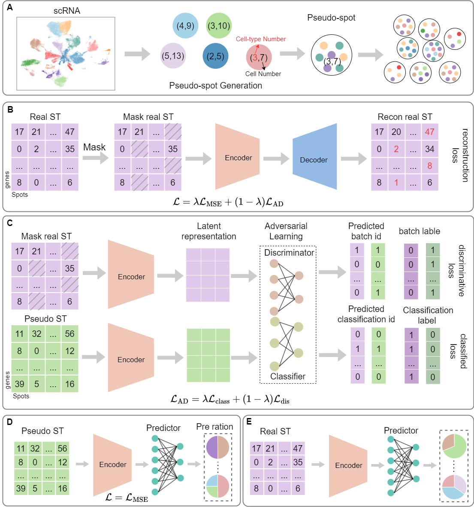

# SpaDAMA
We propose SpaDAMA, a Domain-Adversarial Masked Autoencoder, for cell-type deconvolution in spatial transcriptomics. Utilizing Domain-Adversarial learning, SpaDAMA aligns real ST data with simulated ST data derived from scRNA-seq, mapping both into a common latent space to reduce the modality gap. Additionally, it employs masking strategies to strengthen feature learning from real ST data while suppressing noise and spatial confounders.

## System environment
To run `SpaDAMA`, you need to install [PyTorch](https://pytorch.org) with GPU support first. The environment supporting SpaDAMA and baseline models is specified in the `requirements.txt` file.

## Datasets
The publicly available  datasets were used in this study. You can download them from https://doi.org/10.5281/zenodo.14221635

## Run SpaDAMA and other Baselines models
After configuring the environment, download dataset4 from the Simulated_datasets in the data repository and place it into the Simulated_datasets folder. Then, Run `main_code.py`to start the process.If you want to run other data, simply modify the file path.

## Citing

SpaDAMA: Spatial Transcriptomics Deconvolution Using Domain-Adversarial Masked Autoencoder

## Contact
If you have any questions, please contact huanglin212@aliyun.com and minwenwen@ynu.edu.cn
